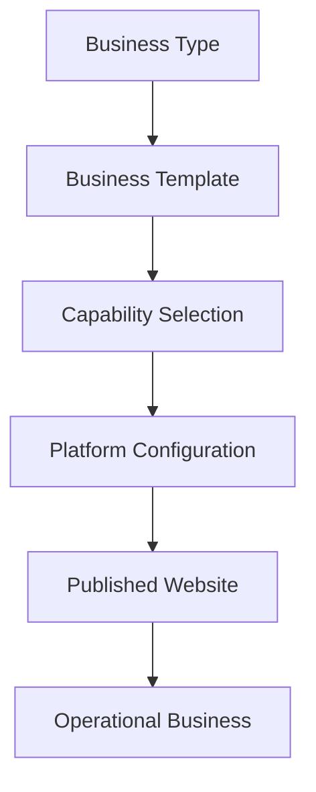

# Product Overview Document

> **Document Status:** Foundational — v1.0
> **Document Type:** Product Vision (not a PRD, not a System Design Document, not a Technical Architecture Document)
> **Audience:** Founders, product team, early stakeholders, future collaborators

---

## Table of Contents

1. [Introduction](#1-introduction)
2. [Vision](#2-vision)
3. [Mission](#3-mission)
4. [Problem Statement](#4-problem-statement)
5. [Current Market Landscape](#5-current-market-landscape)
6. [Our Solution](#6-our-solution)
7. [Core Principles](#7-core-principles)
8. [Target Audience](#8-target-audience)
9. [Product Overview](#9-product-overview)
10. [How It Works](#10-how-it-works)
11. [Why It's Different](#11-why-its-different)
12. [Long-Term Vision](#12-long-term-vision)
13. [Success Metrics](#13-success-metrics)
14. [Future Possibilities](#14-future-possibilities)

---

## 1. Introduction

Service-based businesses — clinics, law firms, salons, gyms, consultancies, studios, and hundreds of similar categories — make up a substantial share of the global economy. Unlike product businesses, their core offering is not a physical good but an appointment, a session, a consultation, or an ongoing engagement with a client.

Despite how common this business model is, the software available to run it is fragmented. A typical service business assembles its digital operations from a patchwork of separate tools: a website builder for its online presence, a scheduling tool for bookings, a separate CRM for client records, a payments processor, a messaging tool, and often a spreadsheet or two holding everything together. Each piece is bought, configured, and maintained independently, and none of them were designed to work as one system.

> We are building a **Business Operating System (Business OS)** for service-based businesses — a single platform that gives any service business its complete digital presence and the operating software to run it, without requiring custom software development.

This document is the first foundational artifact for the product. It exists to align everyone building or evaluating this product around a shared understanding of *what* we are building and *why* — before any conversation about *how*. Technical architecture, system design, and implementation are deliberately out of scope here; they belong in later, separate documents.

---

## 2. Vision

We envision a future in which launching a fully operational service business online is as straightforward as describing what the business does.

In that future:

- A independent physiotherapist and a multi-location dental chain can both get a complete, professional digital operation running in the same amount of time — measured in hours, not months.
- Owning a service business no longer implies owning, integrating, or maintaining a stack of disconnected software products.
- The software a business uses to *present itself to the world* (its website) and the software it uses to *run itself* (scheduling, clients, billing, staff) are the same system, not two systems awkwardly wired together.
- Non-technical founders are not forced to become software buyers, integrators, or amateur system administrators simply to operate a modern business.

This is the world we are building toward: **every service business, regardless of size or industry, operating on a single, coherent, purpose-built platform.**

---

## 3. Mission

Our mission is to get there by building a platform organized around **reusable business capabilities** rather than industry-specific products.

We will:

- Build core capabilities — such as booking, client management, payments, staff management, and messaging — once, to a high standard, and make them reusable across every industry we serve.
- Let a business's digital platform be *composed* from these capabilities rather than custom-built for its specific vertical.
- Package common combinations of capabilities into **business templates**, so a clinic, a salon, or a law firm each start from a sensible, industry-appropriate foundation.
- Continuously expand the library of capabilities and templates so the platform serves an ever-wider range of service businesses without re-solving the same problems repeatedly.

> **Guiding philosophy:** *"Build capabilities once. Reuse them everywhere."*

---

## 4. Problem Statement

Service businesses today face a set of interconnected challenges when trying to establish and operate a digital presence.

### 4.1 Disconnected software, duplicated effort

A typical service business ends up licensing, configuring, and maintaining several unrelated products: a website builder, a booking tool, a CRM, a payments provider, and a communication tool. Each has its own login, its own data model, its own billing relationship, and its own learning curve. Information about the same customer often lives in three or four different places at once, and keeping it consistent is a manual, ongoing burden.

### 4.2 Custom software is expensive and slow

Businesses with more specific operational needs — a hospital needing patient intake workflows, a law firm needing case tracking — often conclude that no off-the-shelf product fits well enough, and consider custom software development. This path is expensive, slow, and creates a long-term maintenance obligation that most service businesses are not equipped to carry.

### 4.3 Industry-specific software doesn't adapt

Conversely, many available "vertical" software products are built narrowly for one industry and resist adaptation. A platform built specifically for gyms rarely serves a photography studio well, even though both fundamentally need scheduling, client records, and payments. Businesses that don't fit the mold the software was designed for are left underserved.

### 4.4 Duplicate implementation of common functionality

Across the software industry, the same underlying capabilities — booking, CRM, payments, notifications — are reimplemented over and over again, once per vertical product, often to an inconsistent standard of quality. This is inefficient for vendors and produces inconsistent, sometimes limited experiences for business owners.

### 4.5 Poor integration between tools

Even when a business successfully assembles a working stack of separate tools, those tools were not designed together. Integrations are often partial, brittle, or entirely absent, forcing manual re-entry of data and creating gaps where information falls through the cracks.

### 4.6 Limited customization, high complexity

Generic website builders are typically presentation-only: they help a business look good online but offer little or nothing for actually running the business — no bookings, no client records, no operational workflow. On the other end, ERP-style systems offer deep operational functionality but are often too complex, too generic, and too heavy for a small or mid-sized service business to configure and adopt.

> **In short:** service businesses are asked to choose between software that is too shallow (website builders), too rigid (vertical SaaS), or too complex (ERP/low-code platforms) — with no option that is purpose-built for what most service businesses actually need: an integrated presence *and* operating system, tailored by capability rather than by rigid industry category.

---

## 5. Current Market Landscape

| Category | What It Does Well | Who It Serves | Where It Falls Short for Service Businesses |
|---|---|---|---|
| **Website Builders** (e.g., WordPress, Wix, Squarespace) | Fast, flexible website creation; strong design and content tooling; large ecosystems | Businesses and individuals who primarily need an online presence | Little to no built-in operational capability — booking, CRM, and billing are typically third-party add-ons, if available at all |
| **Vertical SaaS** (industry-specific booking/CRM tools) | Deep, tailored functionality for one industry; strong domain-specific workflows | Businesses in the specific industry the tool was designed for | Rigid outside that industry; a business that spans categories or has unusual needs is poorly served; still requires a separate website solution |
| **ERP Systems** (e.g., Odoo, Salesforce, ServiceNow, Zoho) | Broad, deep operational functionality; highly configurable; scales to large organizations | Larger organizations with dedicated IT/operations resources | High complexity and setup cost; typically not designed to also produce a public-facing website; often more system than a small service business needs |
| **Low-Code Platforms** (e.g., Bubble) | Flexible enough to build almost any application; powerful for custom workflows | Technical or semi-technical builders willing to construct an application from primitives | Requires build effort and ongoing maintenance not fundamentally different from custom software; not a ready-made solution |

**A note on commerce platforms:** Platforms such as Shopify (and similar product-commerce platforms) solve a related but distinct problem — enabling businesses to sell physical or digital *products* online, with catalogs, inventory, and order fulfillment at their core. This is a different problem from what service businesses face, and these platforms are not designed around appointments, client relationships, or service delivery. We view them as strong solutions to a different problem, not as direct competitors.

None of these categories were built specifically for the shape of a service business: an entity whose core value delivery is an appointment or engagement, and whose software needs span both a public-facing presence *and* internal operations, together.

---

## 6. Our Solution

We are building a platform organized around **capabilities**, not industries.

### 6.1 Capability-driven thinking

Rather than building one product for clinics, a different product for salons, and another for law firms, we identify the underlying capabilities that service businesses commonly need — regardless of industry — and build each one to a high standard, once.

Representative capabilities include:

- Appointment Scheduling & Booking
- Calendar Management
- CRM & Customer Management
- Staff & Team Management
- Payments & Invoicing
- Memberships & Subscriptions
- Documents & Forms
- Messaging & Notifications
- Reports & Analytics
- Reviews
- Content Management (CMS/Blog)
- Workflow Management
- Search
- AI Assistance

### 6.2 Reusable capabilities, not reinvented products

A capability like "Booking" is built once and works across every business type that needs it — a clinic booking a patient appointment, a salon booking a haircut, and a photography studio booking a shoot are all, structurally, the same underlying capability, configured differently.

### 6.3 Business templates

A **business template** is a curated composition of capabilities appropriate for a given kind of business, along with sensible defaults for how those capabilities are configured. Templates are the starting point a business owner selects — not a rigid, unchangeable product.

| Business Type | Example Capability Composition |
|---|---|
| Clinic | Appointment Scheduling, Patient Management, Billing, Notifications |
| Law Firm | Consultation Booking, Client Management, Case Tracking, Documents, Billing |
| Salon | Booking, Staff Management, Payments, Reviews |
| Gym | Membership, Trainer Management, Class Booking, Attendance |
| Photography Studio | Session Booking, Client Gallery, Contracts, Invoices |

### 6.4 Assembling a complete operational platform

A business does not simply get a website. Selecting a template and configuring its capabilities produces a complete platform: a public website, a business dashboard, a customer portal, and — where relevant — a staff portal, all working from the same underlying data and configuration.

> This document intentionally does not describe *how* capabilities are built, composed, or delivered — that is the subject of later technical documentation. Here, the important idea is only that the platform is **assembled from reusable parts, guided by templates**, rather than built fresh for every industry.

---

## 7. Core Principles

| Principle | What It Means | Example |
|---|---|---|
| **Capabilities over industries** | We organize the product around what businesses *need to do*, not the industry label they carry | "Booking" serves a clinic and a salon equally, rather than building "Clinic Booking" and "Salon Booking" separately |
| **Composition over duplication** | Complex offerings are assembled from simpler, well-built parts, rather than each being built from scratch | A law firm's platform reuses the same CRM capability as a consulting firm's platform |
| **Configuration over custom development** | Businesses adapt the platform to their needs through configuration and selection, not by commissioning new software | A gym adds "Class Booking" and "Attendance" to its template instead of hiring developers to build them |
| **Modular thinking** | Capabilities are designed as independent, well-defined modules that can be combined in different ways | Payments can be added to any template that needs it, regardless of industry |
| **Extensibility** | The system is designed to grow — new capabilities and templates can be added over time without disrupting existing ones | A "Case Tracking" capability can be introduced for legal templates without affecting clinic templates |
| **Flexibility** | Businesses are not locked into a rigid, one-size-fits-all structure | A business can start from a template and adjust its capability composition as it grows |
| **Scalability** | The same underlying approach serves a solo freelancer and a multi-location business alike | A single practitioner and a multi-branch hospital both use the same platform, configured differently |
| **Automation** | Where sensible, the platform reduces manual, repetitive operational work | Automated appointment reminders and notifications |
| **Platform-first design** | We think of what we build as one coherent platform, not a bundle of separate tools sharing a login | A business dashboard, customer portal, and public website are facets of one system, not three products |
| **Simplicity** | Despite the depth of capability underneath, the experience of setting up and running a business should remain approachable for non-technical owners | Choosing a template and enabling capabilities should feel like configuration, not engineering |

---

## 8. Target Audience

Our platform is designed to serve a broad range of service businesses, unified by their reliance on appointments, client relationships, and service delivery rather than product sales.

- **Independent professionals** — solo practitioners such as therapists, consultants, tutors, and freelancers who need a professional presence and basic operations without enterprise overhead.
- **Small service businesses** — salons, clinics, repair services, and similar businesses that need an integrated, affordable way to manage bookings, clients, and payments.
- **Medium businesses** — businesses with multiple staff members, more complex scheduling needs, and growing client bases.
- **Multi-location businesses** — organizations operating across several branches or sites that need consistency and centralized oversight alongside local flexibility.
- **Agencies** — businesses managing client relationships and engagements as their core operating model (marketing agencies, event management companies, and similar).
- **Non-technical business owners** — the common thread across all the above: owners and operators who need powerful software but are not — and should not need to be — software builders or IT administrators.
- **Entrepreneurs** — founders launching a new service business who want to get operational quickly, without a long, expensive setup process.

---

## 9. Product Overview

From the perspective of a business owner, using the platform follows a consistent conceptual journey — from describing the business to running it day to day.

- **Business Type** — the owner identifies what kind of business they run (e.g., clinic, salon, law firm, gym).
- **Business Template** — the platform offers a template appropriate to that business type, pre-composed from relevant capabilities.
- **Capability Selection** — the owner reviews, adjusts, adds, or removes capabilities to match their specific needs.
- **Platform Configuration** — the owner configures branding, content, and operational settings for their selected capabilities.
- **Published Website** — a complete, public-facing website is published, backed by the configured capabilities.
- **Operational Business** — the business is now live and operating: accepting bookings, managing clients, processing payments, and running day-to-day operations through the same platform.

---

## 10. How It Works

Conceptually, every business on the platform follows the same underlying structure, regardless of industry:

- A **service business** exists in the real world, with its own specific needs.
- It is matched to a **business template** — a starting composition of capabilities suited to its type.
- That template draws from the platform's library of **reusable capabilities** — the same building blocks used across all industries.
- Once selected and adjusted, these capabilities form a **configured platform** specific to that business — its website, dashboard, and portals.
- The result is a business that can carry out its day-to-day **operations** — bookings, client management, payments, communication — entirely within the platform.

This structure is intentionally the same whether the business is a single-practitioner clinic or a multi-branch chain; what differs is *which* capabilities are selected and *how* they are configured, not the underlying model.

---

## 11. Why It's Different

| Dimension | Website Builders | Vertical SaaS | ERP Systems | Low-Code Platforms | Our Platform |
|---|---|---|---|---|---|
| **Primary focus** | Public presence | Deep, single-industry operations | Broad organizational operations | General-purpose application building | Integrated presence + operations for service businesses |
| **Organizing unit** | Pages and design elements | Industry-specific features | Configurable modules for large orgs | Application primitives | Reusable business capabilities |
| **Adaptability across industries** | High for design, none for operations | Low — built for one industry | Moderate, but complex to configure | High, but requires building effort | High — same capabilities recombined per industry |
| **Setup effort for a non-technical owner** | Low (design only) | Low within its industry, none outside it | High | High | Low — configuration, not construction |
| **Operations included out of the box** | Typically none | Yes, for its specific industry | Yes, broadly | None — must be built | Yes, composed from capabilities |

The essential difference is this: other categories force a service business to choose between *presentation* and *operations*, or between *industry fit* and *flexibility*. Our platform is built on the premise that these should never have been separate choices — a service business needs both its public presence and its operating capabilities to come from the same coherent system, composed to fit its specific needs rather than dictated by rigid industry categories.

---

## 12. Long-Term Vision

Looking beyond the initial product, we see a number of directions the platform could grow into over the coming years. These are aspirations that follow naturally from the platform's capability-driven foundation — not commitments or a fixed roadmap.

- **Plugin ecosystem** — allowing new capabilities to be contributed and adopted beyond what we build ourselves.
- **Industry template marketplace** — a growing library of business templates covering an ever-wider range of service industries, potentially contributed by the community.
- **AI-assisted business setup** — helping business owners go from a description of their business to a configured platform with less manual effort.
- **Workflow automation** — enabling businesses to automate more of their day-to-day operational processes across capabilities.
- **Business intelligence** — deeper reporting and insight generated from the operational data already flowing through the platform.
- **Third-party developer ecosystem** — enabling external developers to build and contribute new capabilities, templates, or integrations.

---

## 13. Success Metrics

We will judge the platform's success not by vanity metrics, but by indicators that reflect whether it is genuinely solving the problem it set out to solve.

| Metric | What It Tells Us |
|---|---|
| **Businesses launched** | Whether the platform is successfully getting new businesses online and operational |
| **Active organizations** | Whether businesses continue to use the platform as their operating system, not just at launch |
| **Template adoption** | Which business types and capability compositions resonate most, and where templates need refinement |
| **Customer retention** | Whether the platform continues to deliver value over time, rather than being abandoned after initial setup |
| **Time required to launch a business** | Whether we are genuinely reducing the effort of going from idea to operational business |
| **Ecosystem growth** | Growth in the range of capabilities, templates, and (eventually) contributors supporting the platform |

---

## 14. Future Possibilities

The ideas below represent directions we may explore in the future. They are included to illustrate the platform's long-term potential and are explicitly separate from the initial product vision described above — none of these are commitments.

- Expansion into adjacent categories of service businesses not yet explicitly considered.
- Deeper AI assistance across operational workflows, not limited to initial setup.
- Cross-business benchmarking and insights, shared anonymously and with consent, to help business owners understand how they compare within their category.
- A certification or quality layer for third-party-contributed capabilities and templates.
- Localization of templates and capabilities for different regions and regulatory environments.
- Community-driven refinement of business templates based on real-world usage patterns.

> **A closing note:** This document represents our current thinking about *what* we are building and *why*. It is a foundation to build from, not a fixed blueprint — we expect it to be revisited and refined as we learn more from the businesses we serve.